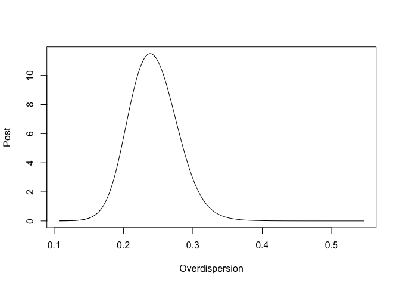
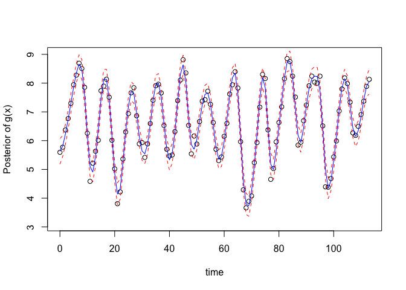
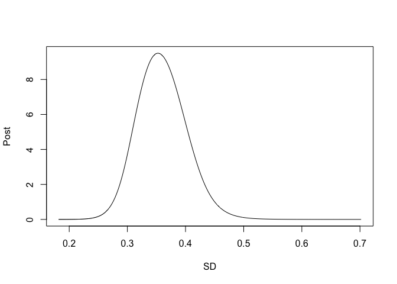
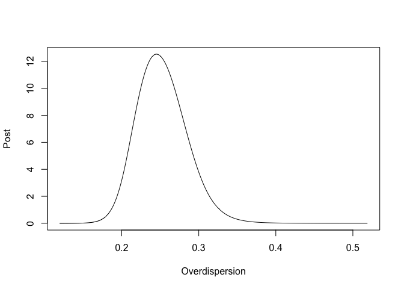

<!-- README.md is generated from README.Rmd. Please edit that file -->

## Introduction:

Welcome to the tutorial on utilizing the proposed methods from the paper
for model-based inference with seasonal Gaussian process (sGP).

In this tutorial, we will use the `lynx` dataset as an example, which
can be accessed directly from R. Let’s load the dataset and visualize
it:

``` r
data <- data.frame(year = seq(1821, 1934, by = 1), y = as.numeric(lynx))
data$x <- data$year - min(data$year)
plot(lynx)
```

<!-- -->

Based on a visual examination of the dataset, we can observe an obvious
10-year quasi-periodic behavior in the lynx count with evolving
amplitudes over time. Therefore, we will consider fitting the following
model:

$$
\begin{aligned}
        y_i|\lambda_i &\sim \text{Poisson}(\lambda_i) ,\\
        \log(\lambda_i) &= \eta_i = \beta_0 + g(x_i) + \xi_i,\\
        g &\sim \text{sGP} \bigg(a = \frac{2\pi}{10}, \sigma\bigg),\\
        \xi_i &\sim N(0,\sigma_\xi).
\end{aligned}
$$

Here, each $y_i$ represents the lynx count, $x_i$ represents the
number of years since 1821, and $\xi_i$ is an observation-level random
intercept to account for overdispersion effect.

## Preparation:

To carry out our inference in a fully Bayesian manner, we will load the
following required packages:

``` r
require(sGPfit)
require(aghq)
require(TMB)
require(tidyverse)
require(Matrix)
```

If you haven’t installed the prototype package sGPfit yet, you can
download it from GitHub using the following command:
`devtools::install_git("https://github.com/AgueroZZ/sGPfit")`.

In this example, we will also use the aghq package for posterior
approximation. To utilize it, we need to compile a C++ template for the
model and load the output. Execute the following code to compile the C++
file and load the resulting library:

``` r
compile(file = paste0(getwd(), "/extsrc/", "tut.cpp"))
dyn.load(dynlib(paste0(getwd(), "/extsrc/", "tut")))
```

Once the C++ file is compiled and the library is loaded, we can proceed
with the remaining inference procedures.

## Prior Elicitation:

To specify the priors for the sGP boundary conditions and the intercept
parameter, we assume independent normal priors with mean 0 and variance
1000. For the overdispersion parameter $\sigma_\xi$, we assign an
exponential prior with $P(\sigma_\xi > 1) = 0.01$.

To determine the prior for the standard deviation parameter $\sigma$ of
the sGP, we employ the concept of predictive standard deviation (PSD).
We start with an exponential prior on the 50 years PSD:
$$P(\sigma(50)>1) = 0.01.$$ To convert this prior to the original
standard deviation parameter $\sigma$, we use the `compute_d_step_sGPsd`
function from the `sGPfit` package:

``` r
prior_PSD <- list(u = 1, alpha = 0.01)
correction_factor <- sGPfit::compute_d_step_sGPsd(d = 50, a = 2*pi/10)
prior_SD <- list(u = prior_PSD$u/correction_factor, alpha = prior_PSD$alpha)
prior_SD
```

    ## $u
    ## [1] 0.1256637
    ## 
    ## $alpha
    ## [1] 0.01

Based on the above computation, the corresponding exponential prior on
the original SD parameter $\sigma$ is: $$P(\sigma>0.126) = 0.01.$$

## Inference of the quasi-periodic function:

First, we need to set up the design matrix `X` for the two boundary
conditions and the intercept parameter:

``` r
x <- data$x
a <- 2*pi/10
X <- as(cbind(cos(a*x),sin(a*x),1), "dgTMatrix")
```

To perform inference for the unknown function $g$ using the sGP, we have
two possible approaches:

-  This approach is most efficient when the locations `x` are equally
  spaced. For large datasets with irregularly spaced locations, the
  second approach using the seasonal B-spline (sB-spline) approximation
  is more computationally efficient.
-  The sGP is approximated as
  $\tilde{g}_k(x) = \sum{i=1}^k w_i \varphi_i(x)$, where
  ${\varphi_i, i \in [k]}$ is a set of sB-spline basis functions, and
  $\boldsymbol{w} = {w_i, i \in [k]}$ is a set of Gaussian weights.

### Inference with the State-Space approach:

To use the state-space representation, we need to create two additional
matrices: $B$ and $Q$. The matrix $B$ is the design matrix of each value
of $[g(x_i),g'(x_i)]$, which will be (mostly) a diagonal matrix in this
case. The matrix $Q$ is the precision matrix of $[g(x),g'(x)]$, which
can be constructed using the `joint_prec_construct` function.

``` r
n = length(x)
B <- Matrix::Diagonal(n = 2*n)[,1:(2*n)]
B <- B[seq(1,2*n,by = 2),][, -c(1:2)]
Q <- joint_prec_construct(a = a, t_vec = x[-1], sd = 1)
Q <- as(as(Q, "matrix"),"dgTMatrix")
```

With the matrices ready, the model can be fitted using `aghq` as
follows:

``` r
tmbdat <- list(
    # Design matrix
    B = B,
    X = X,
    # Precision matrix
    P = Q,
    logPdet = as.numeric(determinant(Q, logarithm = T)$modulus),
    # Response
    y = data$y,
    # Prior
    u = prior_SD$u,
    alpha = prior_SD$alpha,
    u_over = prior_PSD$u,
    alpha_over = prior_PSD$alpha,
    betaprec = 0.001
  )

tmbparams <- list(
    W = c(rep(0, (ncol(B) + ncol(X) + length(data$y)))), 
    theta = 0,
    theta_over = 0
  )
  
ff <- TMB::MakeADFun(
    data = tmbdat,
    parameters = tmbparams,
    random = "W",
    DLL = "tut",
    silent = TRUE
  )
ff$he <- function(w) numDeriv::jacobian(ff$gr,w)
fitted_mod <- aghq::marginal_laplace_tmb(ff,5,c(0,0))
```

### Inference with the seasonal-B spline approach:

To use the sB-spline approach, the sGP is approximated as $\tilde{g}_k(x) = \sum_{i=1}^k w_i \varphi_i(x)$, where $\{\varphi_i, i \in [k]\}$ is a set of sB-spline basis functions, and $\boldsymbol{w} = \{w_i, i \in [k]\}$ is a set of Gaussian weights.

In this case, the design matrix $B$ will be defined with element
$B_{ij} = \varphi_j(x_i)$, which can be constructed using the
`Compute_B_sB` function. The matrix $Q$ will be the precision matrix of
the Gaussian weights $\boldsymbol{w}$, which can be constructed using
the `Compute_Q_sB` function. As an example, let’s consider $k = 30$
sB-spline basis functions constructed with equal spacing:

``` r
B2 <- Compute_B_sB(x = data$x, a = a, region = range(data$x), k = 30)
B2 <- as(B2,"dgTMatrix")
Q2 <- Compute_Q_sB(a = a, k = 30, region = range(data$x))
Q2 <- as(as(Q2, "matrix"),"dgTMatrix")
```

Once these matrices are constructed, the inference can be carried out in
a similar manner as before:

``` r
tmbdat <- list(
    # Design matrix
    B = B2,
    X = X,
    # Precision matrix
    P = Q2,
    logPdet = as.numeric(determinant(Q2, logarithm = T)$modulus),
    # Response
    y = data$y,
    # Prior
    u = prior_SD$u,
    alpha = prior_SD$alpha,
    u_over = prior_PSD$u,
    alpha_over = prior_PSD$alpha,
    betaprec = 0.001
  )

tmbparams <- list(
    W = c(rep(0, (ncol(B2) + ncol(X) + length(data$y)))), 
    theta = 0,
    theta_over = 0
  )
  
ff <- TMB::MakeADFun(
    data = tmbdat,
    parameters = tmbparams,
    random = "W",
    DLL = "tut",
    silent = TRUE
  )
ff$he <- function(w) numDeriv::jacobian(ff$gr,w)

fitted_mod_sB <- aghq::marginal_laplace_tmb(ff,5,c(0,0))
```

### Comparing the results from the two approachs

First, let’s obtain the posterior samples and summary using the
state-space representation:

``` r
## Posterior samples:
samps1 <- sample_marginal(fitted_mod, M = 3000)
```

    ## Warning: 'Matrix::..2dge' is deprecated.
    ## Use '.dense2g' instead.
    ## See help("Deprecated") and help("Matrix-deprecated").

    ## Warning: 'Matrix::..2dge' is deprecated.
    ## Use '.dense2g' instead.
    ## See help("Deprecated") and help("Matrix-deprecated").

``` r
g_samps <- B %*% samps1$samps[1:ncol(B),] + X %*% samps1$samps[(ncol(B) + 1):(ncol(B) + ncol(X)),]
```

``` r
## Posterior summary:
mean <- apply(as.matrix(g_samps), MARGIN = 1, mean)
upper <- apply(as.matrix(g_samps), MARGIN = 1, quantile, p = 0.975)
lower <- apply(as.matrix(g_samps), MARGIN = 1, quantile, p = 0.025)
```

Next, let’s plot the posterior results obtained from the state-space
representation:

``` r
## Plotting
plot(log(data$y) ~ data$x, xlab = "time", ylab = "Posterior of g(x)", ylim = c(3.1,9))
lines(upper ~ data$x, type = "l", col = "red", lty = "dashed")
lines(mean ~ data$x, type = "l", col = "blue")
lines(lower ~ data$x, type = "l", col = "red", lty = "dashed")
```

<!-- -->

``` r
## Posterior of the SD parameter:
prec_marg <- fitted_mod$marginals[[1]]
logpostsigma <- compute_pdf_and_cdf(prec_marg,list(totheta = function(x) -2*log(x),fromtheta = function(x) exp(-x/2)),interpolation = 'spline')
```

    ## Warning: 'Matrix::..2dge' is deprecated.
    ## Use '.dense2g' instead.
    ## See help("Deprecated") and help("Matrix-deprecated").

``` r
plot(pdf_transparam ~ transparam, data = logpostsigma, type = 'l', xlab = "SD", ylab = "Post")
```

<!-- -->

``` r
## Posterior of the Overdispersion parameter:
prec_marg <- fitted_mod$marginals[[2]]
logpostsigma <- compute_pdf_and_cdf(prec_marg,list(totheta = function(x) -2*log(x),fromtheta = function(x) exp(-x/2)),interpolation = 'spline')
```

    ## Warning: 'Matrix::..2dge' is deprecated.
    ## Use '.dense2g' instead.
    ## See help("Deprecated") and help("Matrix-deprecated").

``` r
plot(pdf_transparam ~ transparam, data = logpostsigma, type = 'l', xlab = "Overdispersion", ylab = "Post")
```

<!-- -->

Now, let’s obtain the posterior samples and summary using the seasonal
B-spline approach:

``` r
## Posterior samples:
samps2 <- sample_marginal(fitted_mod_sB, M = 3000)
```

    ## Warning: 'Matrix::..2dge' is deprecated.
    ## Use '.dense2g' instead.
    ## See help("Deprecated") and help("Matrix-deprecated").

    ## Warning: 'Matrix::..2dge' is deprecated.
    ## Use '.dense2g' instead.
    ## See help("Deprecated") and help("Matrix-deprecated").

``` r
g_samps_2 <- B2 %*% samps2$samps[1:ncol(B2),] + X %*% samps2$samps[(ncol(B2) + 1):(ncol(B2) + ncol(X)),]
```

``` r
## Posterior summary:
mean2 <- apply(as.matrix(g_samps_2), MARGIN = 1, mean)
upper2 <- apply(as.matrix(g_samps_2), MARGIN = 1, quantile, p = 0.975)
lower2 <- apply(as.matrix(g_samps_2), MARGIN = 1, quantile, p = 0.025)
```

Finally, let’s plot the posterior results obtained from the seasonal
B-spline approach:

``` r
## Plotting
plot(log(data$y) ~ data$x, xlab = "time", ylab = "Posterior of g(x)", ylim = c(3.1,9))
lines(upper2 ~ data$x, type = "l", col = "red", lty = "dashed")
lines(mean2 ~ data$x, type = "l", col = "blue")
lines(lower2 ~ data$x, type = "l", col = "red", lty = "dashed")
```

<!-- -->

``` r
## Posterior of the SD parameter:
prec_marg <- fitted_mod_sB$marginals[[1]]
logpostsigma <- compute_pdf_and_cdf(prec_marg,list(totheta = function(x) -2*log(x),fromtheta = function(x) exp(-x/2)),interpolation = 'spline')
```

    ## Warning: 'Matrix::..2dge' is deprecated.
    ## Use '.dense2g' instead.
    ## See help("Deprecated") and help("Matrix-deprecated").

``` r
plot(pdf_transparam ~ transparam, data = logpostsigma, type = 'l', xlab = "SD", ylab = "Post")
```

<!-- -->

``` r
## Posterior of the Overdispersion parameter:
prec_marg <- fitted_mod_sB$marginals[[2]]
logpostsigma <- compute_pdf_and_cdf(prec_marg,list(totheta = function(x) -2*log(x),fromtheta = function(x) exp(-x/2)),interpolation = 'spline')
```

    ## Warning: 'Matrix::..2dge' is deprecated.
    ## Use '.dense2g' instead.
    ## See help("Deprecated") and help("Matrix-deprecated").

``` r
plot(pdf_transparam ~ transparam, data = logpostsigma, type = 'l', xlab = "Overdispersion", ylab = "Post")
```

<!-- -->
